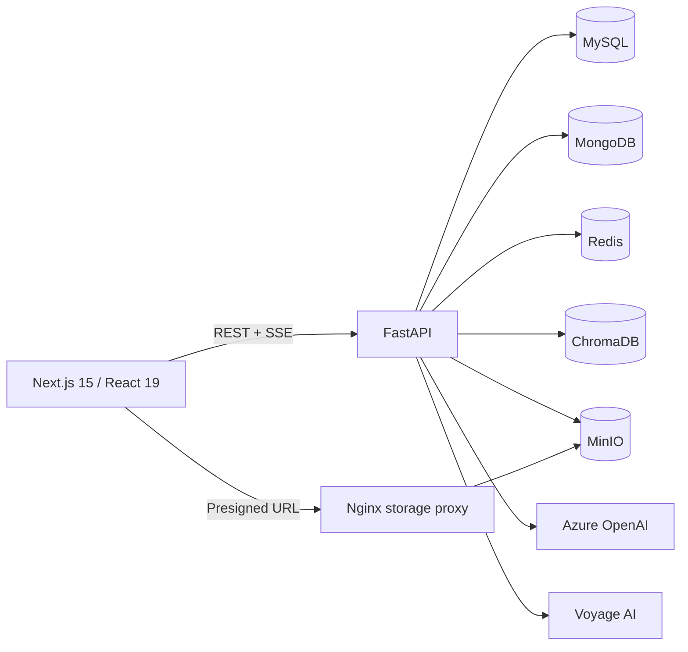

# LearningAId

LearningAId là trợ lý học tập ứng dụng AI, giúp người dùng tổ chức tài liệu theo notebook, hỏi đáp có trích dẫn, tạo nội dung ôn tập và theo dõi tiến độ học tập trên cùng một workspace.

## Tính năng

- **Xác thực và phân quyền:** đăng ký, xác minh email, đăng nhập, refresh token, quên/đặt lại mật khẩu; hai role `admin` và `client`.
- **Notebook:** tạo, chỉnh sửa, xóa, nhân bản notebook và chọn tài liệu đang được dùng làm nguồn kiến thức.
- **Tài liệu:** upload PDF, DOCX, TXT, Markdown hoặc dán văn bản; theo dõi trạng thái xử lý và xem lại nội dung/file gốc.
- **AI Assistant:** chat theo ngữ cảnh notebook bằng RAG, stream câu trả lời qua SSE, hiển thị nguồn trích dẫn và mở đúng vị trí trong tài liệu.
- **Summary:** tạo, lưu và xem lại các bản tóm tắt từ tài liệu đang được chọn.
- **Quiz:** sinh câu hỏi bằng AI, hỗ trợ Study/Exam mode, chấm điểm, gợi ý, lịch sử làm bài và phản hồi cá nhân hóa.
- **Flashcard:** tạo thủ công hoặc bằng AI, quản lý bộ thẻ và ôn tập theo lịch FSRS.
- **Mindmap:** sinh, lưu, xem và xóa sơ đồ tư duy từ nội dung notebook.
- **Dashboard:** thống kê hoạt động học, kết quả quiz, độ chính xác theo loại câu hỏi và insight từ AI.
- **Quản trị:** quản lý người dùng và theo dõi trạng thái hoạt động.

## Kiến trúc



### Vai trò của từng thành phần

| Thành phần | Vai trò |
| --- | --- |
| Next.js | Giao diện người dùng, quản lý workspace và hiển thị luồng chat SSE |
| FastAPI | API, xác thực, nghiệp vụ và điều phối các tác vụ AI |
| MySQL | Tài khoản, phân quyền, notebook, metadata tài liệu, quiz, flashcard và mindmap |
| MongoDB | Nội dung tài liệu đã xử lý, summary và lịch sử hội thoại |
| ChromaDB | Vector embedding phục vụ truy hồi ngữ nghĩa |
| Redis | Session, trạng thái online và thu hồi token |
| MinIO | Lưu file gốc do người dùng upload |
| Nginx | Proxy file MinIO thông qua presigned URL |
| Azure OpenAI | Sinh câu trả lời và nội dung học tập |
| Voyage AI | Tạo embedding cho tài liệu và truy vấn |

### Luồng xử lý tài liệu

1. Người dùng upload file hoặc dán văn bản vào notebook.
2. Backend lưu file gốc vào MinIO và metadata vào MySQL.
3. Background task parse, làm sạch và phân loại nội dung.
4. Nội dung được chia chunk, tạo embedding bằng Voyage AI và lưu vào ChromaDB; nội dung đã xử lý được lưu vào MongoDB.
5. Các tài liệu ở trạng thái active trở thành nguồn cho Assistant, Summary, Quiz, Flashcard và Mindmap.

RAG sử dụng hybrid retrieval (vector search và BM25), Reciprocal Rank Fusion, FlashRank reranking và mở rộng chunk lân cận trước khi gửi context tới LLM.

## Công nghệ

**Frontend:** Next.js 15, React 19, TypeScript, Tailwind CSS 4, Base UI/shadcn, Axios, Recharts, React PDF, KaTeX.

**Backend:** Python 3.12, FastAPI, Pydantic, SQLAlchemy, Alembic, Pytest, Azure OpenAI, Voyage AI, ChromaDB, FlashRank, FSRS.

**Hạ tầng:** MySQL 8, MongoDB 6, Redis 7, MinIO, Nginx và Docker Compose.

## Cấu trúc thư mục

```text
learning-aid/
|-- backend/
|   |-- alembic/             # Migration MySQL
|   |-- app/
|   |   |-- ai/              # LLM, embedding, prompt và output parser
|   |   |-- api/             # FastAPI routers
|   |   |-- core/            # Config, database, security và dependency
|   |   |-- models/          # SQLAlchemy models
|   |   |-- schemas/         # Pydantic schemas
|   |   |-- services/        # Nghiệp vụ theo domain
|   |   |-- storage/         # MinIO abstraction
|   |   `-- main.py          # FastAPI entry point
|   |-- evaluation/          # Công cụ và kết quả đánh giá RAG
|   |-- scripts/             # Seed và tiện ích kiểm tra dữ liệu
|   |-- tests/               # Backend test suite
|   `-- requirements.txt
|-- frontend/
|   |-- src/
|   |   |-- app/             # Next.js App Router
|   |   |-- components/      # UI theo domain
|   |   |-- contexts/        # React contexts
|   |   |-- hooks/           # Custom hooks
|   |   |-- services/        # REST/SSE clients
|   |   |-- types/           # TypeScript types
|   |   `-- utils/           # Tiện ích dùng chung
|   `-- package.json
|-- nginx/                   # Storage reverse proxy
|-- docker-compose.yml
`-- README.md
```

## Khởi chạy bằng Docker

### Yêu cầu

- Docker Desktop hoặc Docker Engine có Docker Compose
- Azure OpenAI API credentials
- Voyage AI API key
- Các cổng `3000`, `8000`, `3306`, `6379`, `9000`, `9001` và `27017` đang trống

### 1. Cấu hình backend

Tạo `backend/.env.dev` với cấu hình sau và thay các giá trị secret/API bằng thông tin của bạn:

```dotenv
PROJECT_NAME=LearningAId

# AI
GEMINI_API_KEY=unused
GEMINI_MODEL=gemini-2.0-flash
VOYAGE_API_KEY=your-voyage-api-key
VOYAGE_MODEL=voyage-4-lite
VOYAGE_EMBEDDING_BATCH_SIZE=32
AZURE_OPENAI_BASE_URL=https://your-resource.openai.azure.com/openai/v1/
AZURE_OPENAI_CHAT_MODEL=your-chat-model
AZURE_OPENAI_MAX_OUTPUT_TOKENS=32768
AZURE_OPENAI_API_KEY=your-azure-openai-api-key
AZURE_OPENAI_ENDPOINT=https://your-resource.openai.azure.com/
AZURE_OPENAI_API_VERSION=2025-04-01-preview
AZURE_OPENAI_DEPLOYMENT=your-deployment

# MySQL
DB_HOST=db
DB_PORT=3306
DB_USER=root
DB_PASSWORD=mysql123456
DB_NAME=learning_aid_db

# Redis và MongoDB
REDIS_HOST=redis
REDIS_PORT=6379
MONGODB_HOST=mongodb
MONGODB_PORT=27017
MONGODB_NAME=learning_aid

# MinIO và ChromaDB
MINIO_ENDPOINT=minio:9000
MINIO_SECURE=false
MINIO_ACCESS_KEY=minioadmin
MINIO_SECRET_KEY=minioadmin
MINIO_BUCKET=learning-aid
CHROMA_PERSIST_DIR=/app/chroma_storage
CHROMA_COLLECTION_NAME=learning_aid_chunks

# Auth
JWT_SECRET_KEY=replace-with-a-long-random-secret
ADMIN_REGISTRATION_KEY=replace-with-an-admin-registration-key
JWT_ALGORITHM=HS256
COOKIE_SECURE=false
ACCESS_TOKEN_EXPIRE_MINUTES=30
REFRESH_TOKEN_EXPIRE_MINUTES=10080
REFRESH_TOKEN_SHORT_EXPIRE_MINUTES=480
ONLINE_STATUS_EXPIRE_SECONDS=300
PENDING_REGISTER_TTL_SECONDS=900
PASSWORD_RESET_TTL_SECONDS=900

# Document và RAG
CHARS_PER_PAGE=3000
RAG_TOP_K=5
RAG_EVALUATION_ENABLED=false
RAG_EVALUATION_OUTPUT_DIR=evaluation/output

# Email
SMTP_HOST=smtp.gmail.com
SMTP_PORT=587
SMTP_USER=your-email@example.com
SMTP_APP_PASSWORD=your-app-password
FRONTEND_URL=http://localhost:3000
```

Backend hiện sử dụng Azure OpenAI tại dependency injection. Các biến Gemini vẫn cần có vì `Settings` đang khai báo chúng là bắt buộc.

### 2. Cấu hình frontend

Tạo `frontend/.env.local`:

```dotenv
NEXT_PUBLIC_API_BASE_URL=http://localhost:8000/api
```

### 3. Cấu hình hostname cho storage

Presigned URL được trả về qua hostname `storage.learningaid.local`. Thêm dòng sau vào file hosts của máy:

```text
127.0.0.1 storage.learningaid.local
```

Trên Windows, file hosts nằm tại `C:\Windows\System32\drivers\etc\hosts`. Trên Linux/macOS, file nằm tại `/etc/hosts`.

### 4. Chạy service và migration

```bash
docker compose up -d --build
docker compose exec backend alembic upgrade head
```

Tạo role, permission và hai tài khoản mẫu:

```bash
docker compose exec backend python -m scripts.seed_users
```

Có thể tạo thêm notebook/metadata mẫu sau khi seed user:

```bash
docker compose exec backend python -m scripts.seed_notebooks
```

Seed notebook chỉ tạo metadata minh họa, không upload file thật vào MinIO và không tạo embedding. Muốn sử dụng đầy đủ tính năng AI, hãy upload tài liệu từ giao diện.

### 5. Truy cập

| Dịch vụ | URL |
| --- | --- |
| Web app | http://localhost:3000 |
| Backend API | http://localhost:8000 |
| Swagger UI | http://localhost:8000/docs |
| ReDoc | http://localhost:8000/redoc |
| MinIO Console | http://localhost:9001 |

Tài khoản development sau khi chạy seed:

| Role | Email | Mật khẩu |
| --- | --- | --- |
| Admin | `admin@example.com` | `Abcd@1234` |
| Client | `client@example.com` | `Abcd@1234` |

Các tài khoản này chỉ dành cho môi trường local. Hãy đổi hoặc xóa chúng trước khi triển khai ở môi trường dùng chung.

### 6. Dừng hệ thống

```bash
docker compose down
```

Xóa cả dữ liệu local trong Docker volumes:

```bash
docker compose down -v
```

## Chạy thủ công

Docker Compose là cách thuận tiện nhất vì backend phụ thuộc đồng thời vào MySQL, MongoDB, Redis, MinIO và ChromaDB. Nếu chạy ứng dụng trực tiếp trên máy, cần tự khởi chạy các dịch vụ phụ trợ và đổi hostname trong `backend/.env.dev` thành địa chỉ tương ứng, thường là `localhost`.

### Backend

Yêu cầu Python 3.12. Chạy từ thư mục `backend`:

```bash
python -m venv .venv
```

Kích hoạt virtual environment:

```bash
# Linux/macOS
source .venv/bin/activate

# Windows PowerShell
.venv\Scripts\Activate.ps1
```

Cài dependency, migrate database và chạy API:

```bash
pip install -r requirements.txt
alembic upgrade head
uvicorn app.main:app --reload
```

### Frontend

Yêu cầu Node.js 20 và npm. Chạy từ thư mục `frontend`:

```bash
npm install
npm run dev
```

## Kiểm tra chất lượng

Backend, chạy từ `backend`:

```bash
pytest
ruff check .
black --check .
```

Frontend hiện chưa có test hoặc lint script. Có thể kiểm tra type và production build bằng:

```bash
npm run build
```

## Biến môi trường

| Nhóm | Biến chính |
| --- | --- |
| AI | `VOYAGE_API_KEY`, `VOYAGE_MODEL`, `AZURE_OPENAI_API_KEY`, `AZURE_OPENAI_ENDPOINT`, `AZURE_OPENAI_DEPLOYMENT`, `AZURE_OPENAI_CHAT_MODEL` |
| MySQL | `DB_HOST`, `DB_PORT`, `DB_USER`, `DB_PASSWORD`, `DB_NAME` |
| MongoDB | `MONGODB_HOST`, `MONGODB_PORT`, `MONGODB_NAME` |
| Redis | `REDIS_HOST`, `REDIS_PORT` |
| MinIO | `MINIO_ENDPOINT`, `MINIO_SECURE`, `MINIO_ACCESS_KEY`, `MINIO_SECRET_KEY`, `MINIO_BUCKET` |
| ChromaDB | `CHROMA_PERSIST_DIR`, `CHROMA_COLLECTION_NAME` |
| Auth | `JWT_SECRET_KEY`, `ADMIN_REGISTRATION_KEY`, các TTL token/cookie |
| Email | `SMTP_HOST`, `SMTP_PORT`, `SMTP_USER`, `SMTP_APP_PASSWORD`, `FRONTEND_URL` |
| Frontend | `NEXT_PUBLIC_API_BASE_URL` |

Không commit `.env.dev`, `.env.local`, API key hoặc mật khẩu thật vào Git.

## Giới hạn hiện tại

- Parser hỗ trợ PDF, DOCX, TXT và Markdown. PDF scan không có text layer chưa được OCR tự động.
- Trang của DOCX được ước lượng theo số ký tự, không phản ánh pagination gốc tuyệt đối.
- Các tác vụ xử lý/sinh nội dung dài chạy bằng FastAPI background task; project chưa cấu hình worker queue riêng.
- CORS, API rewrite và storage hostname đang hướng tới môi trường local development.
- Repository chưa có cấu hình production deployment hoặc CI/CD hoàn chỉnh.

## Ghi chú bảo mật

- Dùng secret mạnh và khác nhau cho JWT, admin registration, database và object storage.
- Đặt `COOKIE_SECURE=true` khi chạy qua HTTPS.
- Không sử dụng credential development mặc định ở production.
- Nếu API key từng được commit hoặc chia sẻ, hãy thu hồi và cấp key mới thay vì chỉ xóa khỏi file.
